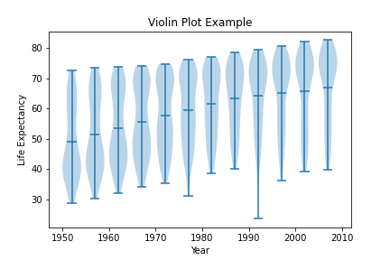
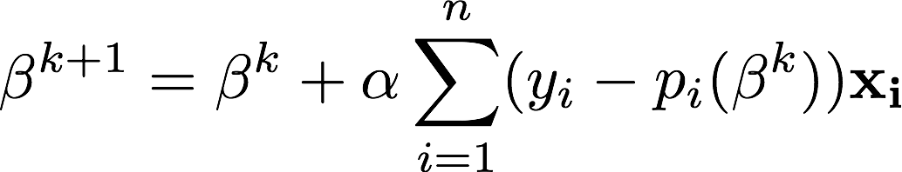
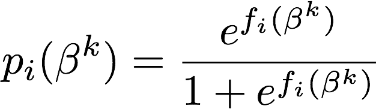
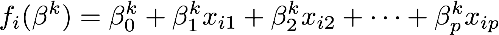

# Project 3

Posted: April 9, 2021

Due: April 28, 2021

## Part 1: Regression analysis of Gapminder data

In this part of this project you will practice and experiment with linear regression using data from [gapminder.org]("http://gapminder.org"). We recommend spending a little time looking at material there, it is quite an informative site.

We will use a subset of data provided by gapminder provided by [Jennifer Bryan](https://jennybryan.org/) described in it’s [github page](https://github.com/jennybc/gapminder)

Get the data from: https://github.com/jennybc/gapminder/blob/master/data-raw/08_gap-every-five-years.tsv

```
import pandas as pd
data = pd.read_csv("gap.tsv", sep='\t')
data.head()
```

```
    country	 continent	year	lifeExp	pop	        gdpPercap
0	Afghanistan	Asia	1952	28.801	8425333	    779.445314
1	Afghanistan	Asia	1957	30.332	9240934	    820.853030
2	Afghanistan	Asia	1962	31.997	10267083	853.100710
3	Afghanistan	Asia	1967	34.020	11537966	836.197138
4	Afghanistan	Asia	1972	36.088	13079460	739.981106
```

For this exercise you will explore how life expectancy has changed over 50 years across the world, and how economic measures like gross domestic product (GDP) are related to it.

**Exercise 1**: *Make a scatter plot of life expectancy across time.*

**Question 1**: *Is there a general trend (e.g., increasing or decreasing) for life expectancy across time? Is this trend linear? (answering this qualitatively from the plot, you will do a statistical analysis of this question shortly)*

A slightly different way of making the same plot is looking at the distribution of life expectancy across countries as it changes over time:

```
    plt.violinplot(life_exp_per_year,years,widths=4,showmeans=True)
    plt.xlabel("Year")
    plt.ylabel("Life Expectancy")
    plt.title("Violin Plot Example")
    plt.savefig("violin.png")
```



This type of plot is called a <em>violin plot</em>, and it displays the distribution of the variable in the y-axis for each value of the variable in the x-axis. (It is okay to use other plotting libraries and tools to create this plot, and others throughout the assignment.)
Note that in order for the example code above, you will have to wrangle the data using Pandas. The way I did it was to create an array for each year, storing the Life Expectancy values for that year, then collected those arrays into a list: `life_exp_per_year`. It's not the only way of doing it, but it's how I first thought of it.

**Question 2**: <em>How would you describe the distribution of life expectancy across countries for individual years? Is it skewed, or not? Unimodal or not? Symmetric around it’s center?</em>

Based on the Violin plot you made, consider the following questions.

**Question 3**: <em>Suppose I fit a linear regression model of life expectancy vs. year (treating it as a continuous variable), and test for a relationship between year and life expectancy, will you reject the null hypothesis of no relationship? (do this without fitting the model yet. I am testing your intuition.)</em>

**Question 4**: <em>What would a violin plot of residuals from the linear model in Question 3 vs. year look like? (Again, don’t do the analysis yet, answer this intuitively)</em>

**Question 5**: <em>According to the assumptions of the linear regression model, what <strong>should</strong> that violin plot look like?  That is, consider the assumptions the linear regression model you used assumes (e.g., about noise, about input distributions, etc); do you think everything is okay?</em>

**Exercise 2**: <em>Fit a linear regression model using, e.g., the `LinearRegression` function from Scikit-Learn or the closed-form solution, for life expectancy vs. year (as a continuous variable).  There is no need to plot anything here, but please print the fitted model out in a readable format.</em>

**Question 6**: <em>On average, by how much does life expectancy increase every year around the world?</em>

**Question 7**: <em>Do you reject the null hypothesis of no relationship between year and life expectancy? Why?</em>

**Exercise 3**: <em>Make a violin plot of residuals vs. year for the linear model from Exercise 2.</em>

**Question 8**: <em>Does the plot of Exercise 3 match your expectations (as you answered Question 4)?</em>

**Exercise 4**: <em>Make a boxplot (or violin plot) of model residuals vs. continent.</em>

**Question 9**: <em>Is there a dependence between model residual and continent? If so, what would that suggest when performing a regression analysis of life expectancy across time?</em>

**Exercise 5**: <em>As in the Moneyball project, make a scatter plot of life expectancy vs. year, grouped by continent, and add a regression line.  The result here can be given as either one scatter plot per continent, each with its own regression line, or a single plot with each continent's points plotted in a different color, and one regression line per continent's points.  The former is probably easier to code up.</em>

**Question 10**: <em>Based on this plot, should your regression model include an interaction term for continent <strong>and</strong> year? Why?</em>

**Exercise 6**: <em>Fit a linear regression model for life expectancy including a term for an interaction between continent and year.  Print out the model in a readable format, e.g., print the coefficients of the model (no need to plot).  Hint: adding interaction terms is a form of feature engineering, like we discussed in class (think about, e.g., using (a subset of) polynomial features here).</em>

**Question 11**: <em>Are all parameters in the model significantly different from zero? If not, which are not significantly different from zero?</em>

**Question 12**: <em>On average, by how much does life expectancy increase each year for each continent? (Provide code to answer this question by extracting relevant estimates from model fit)</em>

**Exercise 7**: <em>Make a residuals vs. year violin plot for the interaction model. Comment on how well it matches assumptions of the linear regression model.</em>


## Part 2: Classification

### Gradient Descent

<p><strong>Problem 1</strong> <em>Implement the gradient descent algorithm (either batch or stochastic versions) for multiple linear regression. I.e., extend the version of the algorithm we discussed in class to multiple parameters.</em></p>
<p>The gradient descent update equation for logistic regression is given by:</p>

<!--
<p><span class="math display">\[
\beta^{k+1} = \beta^k + \alpha \sum_{i=1}^{n} (y_i - p_i(\beta^k))\mathbf{x_i}
\]
-->


<p>where (from the definition of log-odds):</p>

<!--
<p><span class="math display">\[
p_i(\beta^k) = \frac{e^{f_i(\beta^k)}}{1+e^{f_i(\beta^k)}}
\]</span></p>
-->


<p>and
<!--
<span class="math inline">\(f_i(\beta^k) = \beta_0^k + \beta_1^k x_{i1} + \beta_2^k x_{i2} + \cdots + \beta_p^k x_{ip}\)</span>.</p>
-->

</p>

<p><strong>Problem 2</strong> <em>Implement the gradient descent algorithm (either batch or stochastic versions) for multiple logistic regression.</em> I.e., modify your code in problem 1 for the logistic regression update equation.</p>
<p>Make sure you include in your submission writeup, which version of the algorithm you are solving (stochastic or batch), and make sure to comment your code to help us understand your implementation.</p>
<p><strong>Problem 3</strong> To test your programs, simulate data from the linear regression and logistic regression models and check that your implementations recover the simulation parameters properly.</p>

<p>Use the following functions to simulate data for your testing:</p>

<pre class="r"><code>&#35; Generate data for linear regression:
gen_data_x, gen_data_y = sklearn.datasets.make_regression(n_samples=100, n_features=20, noise = 1.5)

&#35; Generate data for logistic regression. This is similar to linear, only now values are either 0 or 1.  
log_gen_data_x, dump_y = sklearn.datasets.make_regression(n_samples=100, n_features=20, noise = 1.5)
log_gen_data_y = [0 if i>0 else 1 for i in dump_y]}</code></pre>

<p>Use gradient descent to find parameters for linear, and for logistic, regression models.  Compare these results to the true parameters generated by <code>sklearn</code>. One such way to do this is the following:</p>


<p>Include a similar plot in your writeup and comment on how your gradient descent implementation is working.</p>
</div>
<div id="try-it-out" class="section level2">

<h3>Try it out!</h3>

<ol style="list-style-type: lower-alpha">
<li><p>Find a dataset on which to try out different classification (or regression) algorithms. </p></li>
<li><p>Choose <strong>two</strong> of the following algorithms:</p></li>
</ol>
<ol style="list-style-type: decimal">
<li>Linear Discriminant Analysis (LDA) (only classification)</li>
<li>classification (or regression) trees,</li>
<li>random forests<br />
</li>
<li>linear SVM,</li>
<li>non-linear SVM</li>
<li>k-NN classification (or regression)</li>
</ol>
<p>and compare their prediction performance on your chosen dataset to your logistic regression gradient descent implementation using 10-fold cross-validation and a paired t-test (one for each of the two algorithms vs. your logistic regression code). Note: for those algorithms that have hyper-parameters, i.e., all of the above except for LDA, you need to specify in your writeup which model selection procedure you used.</p>
</div>


<div id="handing-in" class="section level2">

### Handing in:

 * As usual, we expect a Notebook (in PDF, or _static_ HTML form) where each problem and question are addressed as code and/or prose (where appropriate). We expect the code to be commented (the _how_) and the prose to explain _what_ and _why_.
 * For the part that requires you to choose your own dataset, organize your writeup as follows:</p></li>
    - Describe the dataset you are using, including: what is the outcome you are predicting (remember this should be a classification task) and what are the predictors you will be using.</p></li>
    - Include code to obtain and prepare your data as a dataframe to use with your three classification algorithms. In case your dataset includes non-numeric predictors, include the code you are using to transform these predictors into numeric predictors you can use with your logistic regression implementation.</p></li>
    - Specify the two additional algorithms you have chosen in part (b), and for algorithms that have hyper-parameters specify the method you are using for model selection.</p></li>
    - Include all code required to perform the 10-fold cross-validation procedure on your three algorithms.</p></li>
    - Write up the result of your 10-fold cross-validation procedure. Make sure to report the 10-fold CV error estimate (with standard error) of each of the three algorithms. Also report on the result of the <em>two</em> paired t-tests comparing your logistic regression algorithm with your chosen two algorithms.</p></li>

## Extra Credit

There are two opportunities for extra credit on this project:

 * The first is straightforward: For each day the project is submitted early, you get 5 extra credit points, for a maximum of 15 points. 

* Additionally, there will be opportunity for "Above and Beyond" points. These points are given at the discretion of the grader, _and can not be negotiated_. This is for students who show a significant depth of understanding and who explore the possibilities of the assignment beyond the descriptions set out in the instructions. For an example of an "Above and Beyond" submission for Project 2 see [this submission](files/project2_above_and_beyond.pdf) (there was no such extra credit for Project 2, this is just an example of what would get the points)

### Final Project Groups

If you would like to form a group for the final project, you must do one of the following:

  * Decide on a group by April 16th and email JMCT with `[CMSC320 GROUP]` as the subject line (no more no less)
  * If you want to be put into a group, you should email JMCT with `[CMSC320 LFG]` as the subject line by April 14th.

I will perform a search for _those exact subject lines_, and use that to populate the gradebook.
